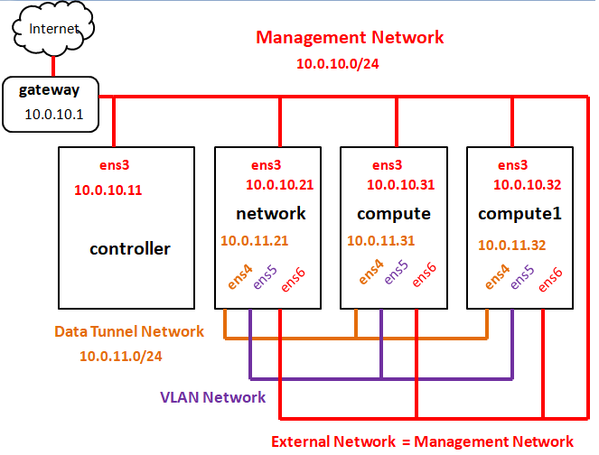

# openstack-ocata-installer

Copyright 2017 Kasidit Chanchio 

Contact: kasiditchanchio@gmail.com  
Department of computer science  
Faculty of science and technology  
Thammasat University.

<h3>การติดตั้งระบบ OpenStack Ocata แบบ Multi-node & DVR ด้วย installation scripts บน ubuntu 16.04 </h3>  

ให้ นศ เตรียมเครื่องตามส่วนที่ 1 และหลังจากนั้นเลือกเอาอันใดอันหนึ่งว่าจะติดตั้งด้วย scripts(ส่วนที่ 2) หรือด้วยมือ (ส่วนที่ 3)  
<ul>
 <li> 1. <a href="#part1">เตรียมเครื่องและเนตสำหรับติตดั้ง</a>
 <li> 2. <a href="#part2">ติดตั้งด้วย scripts</a> 
 <li> 3. <a href="#part3">ติดตั้งด้วยมือ</a> 
</ul>

<a id="part1"><h4>ส่วนที่ 1: เตรียมเครื่องและเนตสำหรับติดตั้ง</h4></a>

 
  นศ จะเตรียมเครื่อง ubuntu 16.04.x จำนวน 4 เครื่องเชื่อมต่อกันบนเนตดังภาพที่ 1 ได้แก่เครื่องชื่อ controller network compute และ compute1 (ชื่อเครื่องต้องตรงกับผลจากคำสั่ง hostname) จากภาพกำหนดให้เครื่องที่ controller มี spec แนะนำคือ cpu 4 cores RAM 6 ถึง 8 GB Disk 16-20 GB เครื่อง network มี cpu 1-2 cores RAM 512MB-1GB Disk 8-10 GB เครื่อง compute และ compute1 มี cpu 4 cores RAM 2-4 GB Disk 16-20 GB (เป็น spec ใช้สำหรับการศึกษา ถ้าจะ deploy ขอให้ดู official OpenStck doc) 
  

    
   ภาพที่ 1  
กำหนดให้ทุกเครื่องมี username คือ opensatck และ password คือ openstack และเพื่อความสะดวกแนะนำว่าให้ทำให้ทุกเครื่องใช้ sudo โดยไม่ต้องป้อน password อีกอย่างที่สำคัญคือเครื่องเหล่านี้ควรมีเวลาใกล้เคียงกัน
   

สำหรับเนต (network) กำหนดให้มีเนตสี่แบบเชื่อมกับเครื่องทั้งสี่ดังภาพได้แก่ 
 <ul>
 <li> management network: มี cidr 10.0.10.0/24 และ gateway คือ 10.0.10.1  openstack ใช้เนตนี้เป็นเนตหลักเพื่อออกอินเตอเนตและส่งคำสั่งระหว่างโหนด(หรือเครื่องทั้ง 4)ต่างๆของมัน 
 <li> data tunnel network: ใช้สร้าง tunnel สำหรับส่งข้อมูลของ vm ที่จะถูกสร้างขึ้นภายใน openstack เนตนี้ใช้สำหรับส่งข้อมูลระว่าง vm กันเอง (east-west) และระหว่าง vm กับ internet (north-south)
 <li> vlan network: ใช้ส่งข้อมูลระหว่าง vm ภายใน openstack กับ vlan network ภายนอก openstack 
 <li> external network: คือเนตที่เป็น internet service provider ของ openstack ในที่นี้เราจะใช้ management network 
 </ul>
จากภาพที่ 1 สมมุตว่า NIC ที่ 1 คือ ens3 NIC ที่ 2 คือ ens4 NIC ที่ 3 คือ ens5 NIC ที่ 4 คือ ens6 จะเห็นว่าเครื่อง conroller มี ens3 อันเดียว เครื่อง network compute แบะ compute1 ทั้งหมด มี ens3 ถึง ens6

 ในขั้นต้นให้ นศ กำหนดค่า apt configuration ของเครื่องต่างๆให้ใช้ ubuntu repository ในประเทศไทย โดยกำหนดค่าใน /etc/apt/sources.list ด้วยมือ หรือใช้คำสั่ง 
 <pre>
  sudo sed -i "s/us.arch/th.arch/g" /etc/apt/sources.list
 </pre>
 และให้ นศ กำหนด network configuration ดังตัวอย่างข้างล่าง ซึ่งเป็นการกำหนดค่า IP address ของทุกเครื่งอบน management network โดยที่ทุก interface มี MTU คือ 1500 

 <b>เครื่อง controller </b> 
<pre>
openstack@controller:~$ cat /etc/network/interfaces
...
auto lo
iface lo inet loopback
...
auto ens3
iface ens3 inet static
address 10.0.10.11
netmask 255.255.255.0
network 10.0.10.0
gateway 10.0.10.1
dns-nameservers 8.8.8.8

openstack@controller:~$
openstack@controller:~$ ifconfig
ens3      Link encap:Ethernet  HWaddr 00:54:09:25:20:17
          inet addr:10.0.10.11  Bcast:10.0.10.255  Mask:255.255.255.0
          inet6 addr: fe80::254:9ff:fe25:2017/64 Scope:Link
          UP BROADCAST RUNNING MULTICAST  MTU:1500  Metric:1
          RX packets:17777 errors:0 dropped:0 overruns:0 frame:0
          TX packets:12906 errors:0 dropped:0 overruns:0 carrier:0
          collisions:0 txqueuelen:1000
          RX bytes:5715989 (5.7 MB)  TX bytes:2963058 (2.9 MB)

lo        Link encap:Local Loopback
          inet addr:127.0.0.1  Mask:255.0.0.0
          inet6 addr: ::1/128 Scope:Host
          UP LOOPBACK RUNNING  MTU:65536  Metric:1
          RX packets:160 errors:0 dropped:0 overruns:0 frame:0
          TX packets:160 errors:0 dropped:0 overruns:0 carrier:0
          collisions:0 txqueuelen:1
          RX bytes:11840 (11.8 KB)  TX bytes:11840 (11.8 KB)

openstack@controller:~$
openstack@controller:~$ ip link
1: lo: <LOOPBACK,UP,LOWER_UP> mtu 65536 qdisc noqueue state UNKNOWN mode DEFAULT group default qlen 1
    link/loopback 00:00:00:00:00:00 brd 00:00:00:00:00:00
2: ens3: <BROADCAST,MULTICAST,UP,LOWER_UP> mtu 1500 qdisc pfifo_fast state UP mode DEFAULT group default qlen 1000
    link/ether 00:54:09:25:20:17 brd ff:ff:ff:ff:ff:ff
openstack@controller:~$
</pre>

 <b>เครื่อง network </b>
<pre>

</pre>

 <b>เครื่อง compute </b>
<pre>
</pre>

 <b>เครื่อง compute1 </b>
<pre>
</pre> 

<a id="part2"> 
<h4>ส่วนที่ 2: ติดตั้งด้วย scripts</h4>
</a>
<pre>
$ cd $HOME
$ git clone https://github.com/kasidit/openstack-ocata-installer
$ cd openstack-ocata-installer
</pre>

<a id="part2"> 
<h4>ส่วนที่ 3: ติดตั้งด้วยมือ</h4>
</a>

<b>อ้างอิง</b>
1. http://sciencecloud-community.cs.tu.ac.th/ 
2. http://vasabilab.cs.tu.ac.th/ 
3. http://docs.openstack.org/
